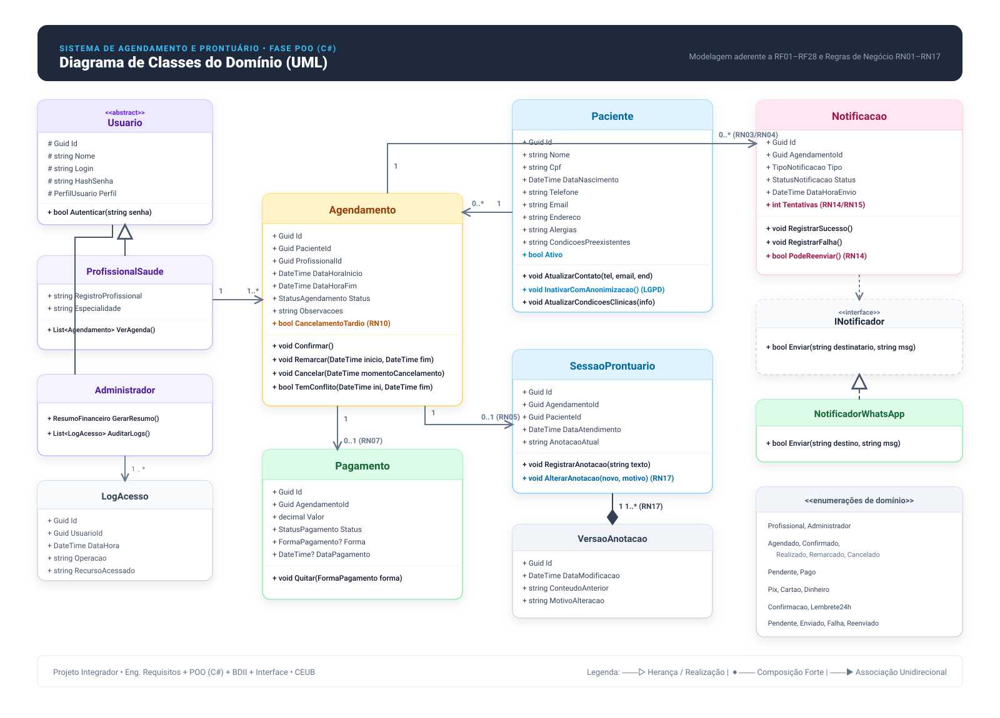

# Sistema de Agendamento e Prontuário para Clínicas Pequenas

> **Projeto Integrador Multidisciplinar** — Engenharia de Software (CEUB)  
> Sistema simplificado de agendamento e prontuário eletrônico voltado para profissionais autônomos de saúde (psicólogos, nutricionistas, fisioterapeutas, etc.).

---

## 🎯 Divisão do Projeto (4 Fases)

O projeto é estruturado de forma integrada através de 4 disciplinas de Engenharia de Software:

```
┌──────────────────────────────────────────────────────────────────────────────┐
│                            PROJETO INTEGRADOR                                │
├──────────────────┬──────────────────┬───────────────────┬────────────────────┤
│ 1. Eng. Requisitos│ 2. POO (C#)      │ 3. Banco Dados II │ 4. Desenv. Interf. │
│   [✅ CONCLUÍDO]  │  [🚀 FOCO ATUAL]  │   [⏳ PLANEJADO]  │   [⏳ FUTURO]      │
└──────────────────┴──────────────────┴───────────────────┴────────────────────┘
```

| Fase | Disciplina | Foco & Entregáveis | Status |
| :--- | :--- | :--- | :---: |
| **Parte 1** | **Engenharia de Requisitos** | Mapeamento BPMN, Levantamento com cliente, 28 RFs, 7 RDs, 17 RNs e 16 RQs (ISO/IEC 25010). | ✅ Concluído |
| **Parte 2** | **Programação Orientada a Objetos** | Modelagem de classes de domínio, encapsulamento de regras de negócio em C# e aplicação Console CLI iterativa. | 🚀 Em andamento |
| **Parte 3** | **Banco de Dados II** | Modelo relacional (DER/MER), tabelas normalizadas, integridade referencial, transações ACID e consultas analíticas. | ⏳ Próxima fase |
| **Parte 4** | **Desenvolvimento de Interface** | Interface acessível e responsiva focada no fluxo rápido de atendimento (agendamento em até 3 cliques). | ⏳ Futuro |

---

## 📐 Modelagem Orientada a Objetos (Diagrama de Classes)

O diagrama abaixo representa as entidades, métodos, enumerações e relações do domínio, cobrindo integralmente as regras de negócio de **RF01 a RF28** e **RN01 a RN17**:

<p align="center">
  
</p>

* 📄 **Documentação detalhada das classes:** [`docs/diagramas/README.md`](docs/diagramas/README.md)
* 🎨 **Arquivo editável no Excalidraw:** [`docs/diagramas/diagrama_classes.excalidraw`](docs/diagramas/diagrama_classes.excalidraw) *(abra em [excalidraw.com](https://excalidraw.com) ou na extensão Excalidraw do VS Code)*

---

## 📋 Status Atual de Entregas

- [x] **Parte 1 — Engenharia de Requisitos**
  - [x] Levantamento e elicitação de necessidades do cliente
  - [x] Mapeamento de processo "TO-BE" em BPMN
  - [x] Especificação formal de Requisitos Funcionais (RF01–RF28) e Requisitos de Dados (RD01–RD07)
  - [x] Definição de Regras de Negócio (RN01–RN17) e Requisitos de Qualidade (RQ01–RQ16)
  - [x] Validação com cliente simulado e consolidação de decisões (LGPD, exclusão lógica, WhatsApp)
- [ ] **Parte 2 — Programação Orientada a Objetos (C#)**
  - [x] Modelagem do Diagrama de Classes UML (SVG e Excalidraw)
  - [x] Documento de Arquitetura e Design de Software (SDD)
  - [x] Implementação de 100% das entidades de domínio e enumerações em C# (.NET 8):
    - `Paciente` (RD01, RN16, RQ03 — exclusão lógica com anonimização LGPD)
    - `Agendamento` (RD02, RN01, RN02, RN10 — colisão de horários e cancelamento tardio <24h)
    - `SessaoProntuario` e `VersaoAnotacao` (RD04, RN05, RN06, RN17 — histórico imutável de edições)
    - `Pagamento` (RD05, RN07, RN08 — quitação financeira e controle de status)
    - `Notificacao` (RF12–RF14, RN14, RN15 — resiliência com 1 retentativa após 15 min)
    - `LogAcesso` (RF28, RN13, RQ07 — auditoria imutável de acessos sensíveis)
    - `Usuario`, `ProfissionalSaude`, `Administrador` (RF26, RF27, RN12, RQ08 — herança, hash SHA256 e polimorfismo)
  - [x] Suíte de Testes Automatizados (TDD com xUnit — 23 testes unitários aprovados)
  - [x] Implementação de 100% das Interfaces de Domínio (`IPacienteRepository`, `IAgendamentoRepository`, `IProntuarioRepository`, `IPagamentoRepository`, `IUsuarioRepository`, `ILogAcessoRepository`, `INotificador`)
  - [x] Implementação de 100% dos Repositórios em Memória (`List<T>`) na Infraestrutura:
    - `InMemoryPacienteRepository`
    - `InMemoryAgendamentoRepository`
    - `InMemoryProntuarioRepository`
    - `InMemoryPagamentoRepository`
    - `InMemoryUsuarioRepository`
    - `InMemoryLogAcessoRepository`
  - [ ] Implementação de Notificador concreto (`NotificadorWhatsApp`)
  - [ ] Implementação das regras de negócio em serviços (`AgendaService`, `ProntuarioService`, `FinanceiroService`, `AuthService`)
  - [ ] Interface Console interativa para testes e demonstração do MVP
- [ ] **Parte 3 — Banco de Dados II**
  - [ ] Modelo Conceitual e Lógico/Físico (DER)
  - [ ] Scripts DDL/DML, integridade e transações de concorrência
- [ ] **Parte 4 — Desenvolvimento de Interface**
  - [ ] Protótipo e telas de usuário simplificadas

---

## 🧪 Como Executar os Testes Automatizados

O projeto utiliza a metodologia **TDD (Test-Driven Development)** com o framework **xUnit** no **.NET 8**.

### Pré-requisitos
* [.NET 8 SDK](https://dotnet.microsoft.com/download/dotnet/8.0) instalado.

### Executar a suíte de testes
No terminal, a partir da raiz do repositório:

```bash
dotnet test src/
```

**Resultado esperado:**
```text
Aprovado! – Com falha: 0, Aprovado: 23, Ignorado: 0, Total: 23
```

### Regras de Negócio Validadas nos Testes
| Regra / Requisito | Cenário de Teste Validado | Arquivo de Teste |
| :--- | :--- | :--- |
| **RN01 / RN02** | Detecção de conflito e colisão de horários entre consultas | `AgendamentoTests.cs` |
| **RN10** | Identificação automática de cancelamento tardio (< 24h) | `AgendamentoTests.cs` |
| **RN16 / RQ03** | Inativação com anonimização de dados pessoais (LGPD) | `PacienteTests.cs` |
| **RN17** | Histórico imutável de anotações do prontuário ao editar | `SessaoProntuarioTests.cs` |
| **RN07 / RN08** | Ciclo de quitação e transição de status de pagamento | `PagamentoTests.cs` |
| **RN14 / RN15** | Resiliência: permite apenas 1 retentativa 15 min pós-falha | `NotificacaoTests.cs` |
| **RF28 / RQ07** | Registro de auditoria imutável de acessos sensíveis | `LogAcessoTests.cs` |
| **RQ08 / RN12** | Autenticação via hash SHA256 e permissões de auditoria | `UsuarioTests.cs` |

---

## 📂 Estrutura do Repositório

```
├── docs/
│   ├── design/
│   │   └── SDD_Software_Design_Document.md     # Documento de Arquitetura e Design de Software
│   ├── diagramas/
│   │   ├── README.md                           # Catálogo central de todos os diagramas
│   │   ├── diagrama_classes.svg                # Diagrama de Classes UML (vetorial estilizado)
│   │   ├── diagrama_classes.excalidraw         # Diagrama de Classes UML (editável no Excalidraw)
│   │   ├── diagrama_sequencia.md               # Diagramas de Sequência UML (Fluxos Críticos)
│   │   ├── diagrama_arquitetura.md             # Diagrama de Arquitetura em Camadas
│   │   └── diagrama_bpmn_processo.md           # Diagrama de Processo de Negócio TO-BE (BPMN / Raias)
│   ├── requisitos/
│   │   └── Documento_Especificacao_Requisitos_Final.docx # Especificação formal completa
│   └── Projeto_Integrador_Contexto_Completo.md # Memória e histórico unificado do projeto
├── src/
│   ├── ClinicaApp.slnx                         # Solução .NET 8
│   ├── ClinicaApp/                             # Core de Domínio e Regras da Clínica
│   │   ├── Domain/
│   │   │   ├── Entities/                       # Paciente, Agendamento, SessaoProntuario, etc.
│   │   │   ├── Enums/                          # StatusAgendamento, PerfilUsuario, etc.
│   │   │   └── Interfaces/                     # Contratos de repositório e notificação
│   │   ├── Infrastructure/
│   │   │   └── InMemory/                       # Implementações de persistência em memória (List<T>)
│   │   └── ClinicaApp.csproj
│   └── ClinicaApp.Tests/                       # Suíte de Testes Automatizados (xUnit)
│       ├── Domain/                             # Testes unitários das regras de negócio
│       └── ClinicaApp.Tests.csproj
└── README.md
```

---

## 👨‍💻 Autor

**Davi Felinto**  
Estudante de Engenharia de Software — CEUB (Brasília/DF)  
GitHub: [@Davi-Felinto](https://github.com/Davi-Felinto)
