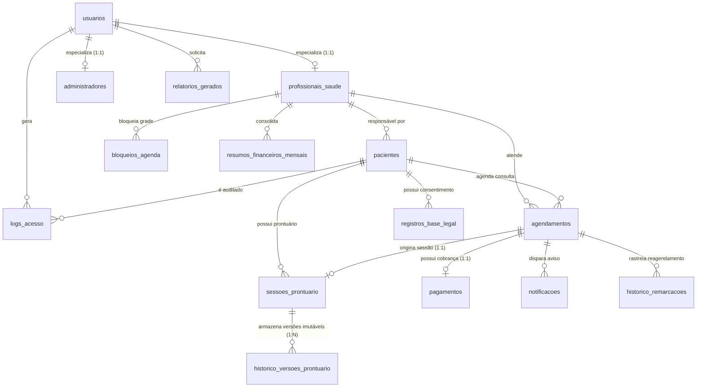

# 🗄️ Modelagem de Banco de Dados Relacional (MySQL) — Clinix

> **Projeto Integrador Multidisciplinar** — Engenharia de Software (CEUB)  
> **Disciplina:** Banco de Dados II (MySQL 8.0+)  
> **Responsáveis:** Isaac *(Modelagem Lógica & DDL Relacional)* e Davi Felinto *(Arquitetura & Integração C#/.NET)*

---

## 📌 Visão Geral do Módulo

Este diretório contém a modelagem completa do banco de dados relacional para o **Clinix** (Sistema de Agendamento e Prontuário para Clínicas Pequenas), cobrindo integralmente as 15 entidades concebidas para suportar a matriz de requisitos acadêmicos (**RF01–RF28**, **RN01–RN17** e **RQ01–RQ16**).

Os artefatos foram projetados para permitir que o backend C# substitua os repositórios em memória (`ClinicaApp.Infrastructure.InMemory`) por implementações relacionais usando **Dapper** ou **Entity Framework Core**, mantendo intacto o núcleo do Domínio (**Repository Pattern**).

---

## 📁 Estrutura de Arquivos

```
bancodedadosclinica/
├── clínica.mwb            # Modelo lógico oficial no MySQL Workbench 8.0 (atualizado com as 4 melhorias)
├── clínica_original.mwb   # Backup da modelagem inicial criada pelo Isaac
├── 01_schema_ddl.sql      # Script DDL completo de criação do banco e das 15 tabelas (chaves, índices e constraints)
├── 02_dados_iniciais.sql  # Script DML com carga de dados (seed) de demonstração e testes
└── README.md              # Este documento técnico explicativo
```

---

## 🧩 Diagrama Entidade-Relacionamento (DER Lógico)



---

## 🛠️ As 4 Melhorias Aplicadas no Modelo Lógico

Após auditoria técnica em conjunto com a arquitetura de software, foram implementadas 4 otimizações para alinhar o modelo com as regras de negócio reais da clínica:

| # | Ponto de Atenção | Situação Inicial | Melhoria Aplicada | Motivo Técnico / Benefício |
|---|---|---|---|---|
| **1** | **Vínculo do Paciente** | `id_profissional_responsavel` marcado como `NOT NULL`. | Alterado para `NULL` com `ON DELETE SET NULL`. | Permite que a recepção/administração cadastre o paciente sem amarrá-lo a um único médico no primeiro instante, viabilizando clínicas multidisciplinares. |
| **2** | **Índice UNIQUE em Agendamentos** | `uq_agendamento_paciente` composto por `(id_agendamento, id_paciente)`. | Substituído por `uq_agend_paciente_horario (id_paciente, data_hora_inicio)`. | Elimina a redundância (pois `id_agendamento` já é PK) e protege o paciente contra agendamentos duplicados no mesmo instante. |
| **3** | **Enums e Compatibilidade C#** | Enums isolados no MySQL. | Documentação e compatibilidade direta com `enum` em C#. | Facilita o mapeamento transparente tanto via Dapper quanto via Entity Framework Core (`ValueConversion` ou inteiros). |
| **4** | **Anonimização LGPD (RN16, RQ03)** | `documento_identificacao` marcado como `NOT NULL UNIQUE`. | Alterado para `NULL` mantendo a restrição `UNIQUE`. | No MySQL, múltiplos registros podem conter `NULL` em índices UNIQUE sem gerar colisão de chave, viabilizando a anonimização de vários pacientes inativados. |

---

## 📋 Dicionário de Dados Resumido (15 Tabelas)

1. **`usuarios`**: Tabela central de autenticação com hash criptográfico PBKDF2/SHA-256 + Salt (`RQ08`).
2. **`profissionais_saude`**: Especialização de usuários médicos/psicólogos com registro de conselho (`CRM`/`CRP`).
3. **`administradores`**: Especialização de colaboradores administrativos e recepcionistas.
4. **`pacientes`**: Ficha cadastral com flags de inativação lógica (`RN16`) e data de anonimização LGPD (`RQ03`).
5. **`registros_base_legal`**: Rastreabilidade do fundamento jurídico (Art. 7º e 11 da LGPD) para o tratamento dos dados clínicos.
6. **`agendamentos`**: Horários de consultas, verificação de cancelamento tardio com menos de 24 horas (`RN10`) e colisão (`RN01, RN02`).
7. **`bloqueios_agenda`**: Intervalos de bloqueio de grade por médico (almoço, férias, congressos).
8. **`historico_remarcacoes`**: Auditoria completa de reagendamento de consultas.
9. **`sessoes_prontuario`**: Ficha de anotações médicas vinculada unicamente à consulta (`RF15, RN05`).
10. **`historico_versoes_prontuario`**: Versionamento imutável de edições com justificativa clínica (`RN17`).
11. **`pagamentos`**: Cobranças com restrição de unicidade por consulta (`RN07`) e forma de quitação (`RN08`).
12. **`resumos_financeiros_mensais`**: Fechamento mensal consolidado de faturamento e pendências (`RN09`).
13. **`notificacoes`**: Fila de mensagens WhatsApp com controle de tentativas e agendamento de retry (`RF12–RF14`).
14. **`logs_acesso`**: Trilha de auditoria imutável com precisão em milissegundos (`RN13, RQ07`).
15. **`relatorios_gerados`**: Histórico de extrações de dados e relatórios exportados.

---

## 🚀 Como Executar no MySQL

### Opção 1: Via MySQL Workbench
1. Abra o **MySQL Workbench**.
2. Conecte-se à sua instância local do MySQL Server.
3. Acesse `File -> Open SQL Script...` e selecione `01_schema_ddl.sql`.
4. Execute o script (`Ctrl + Shift + Enter`) para criar o banco de dados `clinix_db` e as 15 tabelas.
5. Em seguida, abra e execute `02_dados_iniciais.sql` para popular a base de teste.

### Opção 2: Via Terminal (Linux / Windows PowerShell)
```bash
# Criar o banco e a estrutura
mysql -u root -p < bancodedadosclinica/01_schema_ddl.sql

# Inserir os dados demonstrativos
mysql -u root -p < bancodedadosclinica/02_dados_iniciais.sql
```
