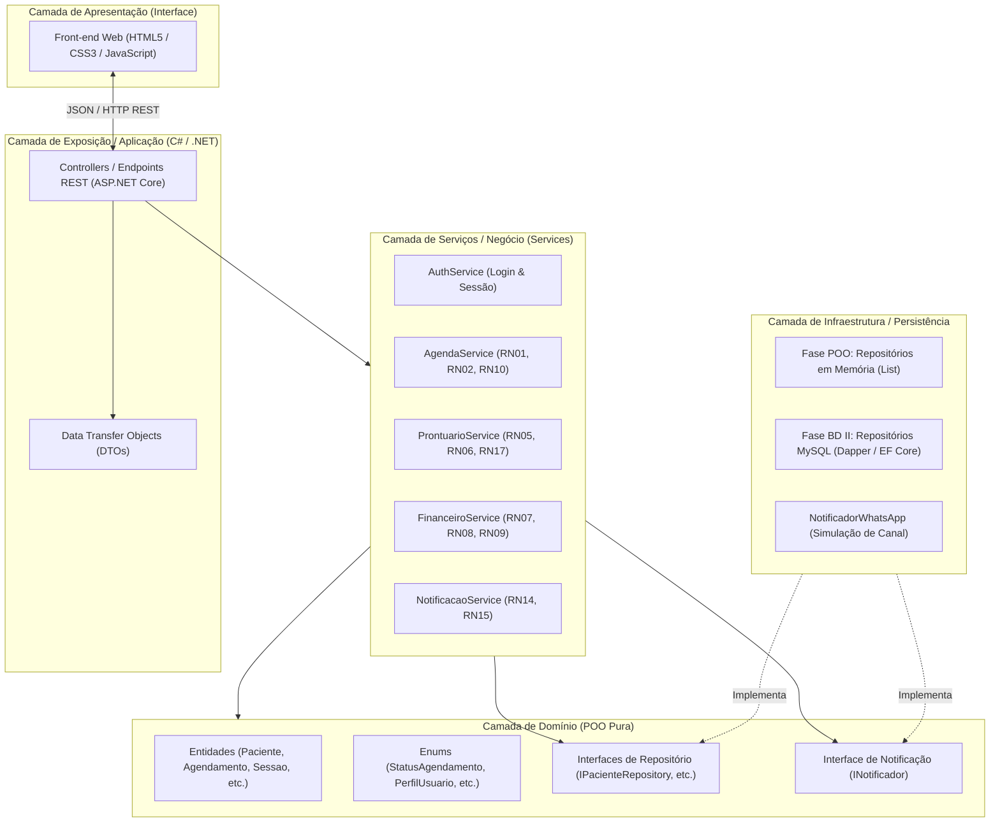
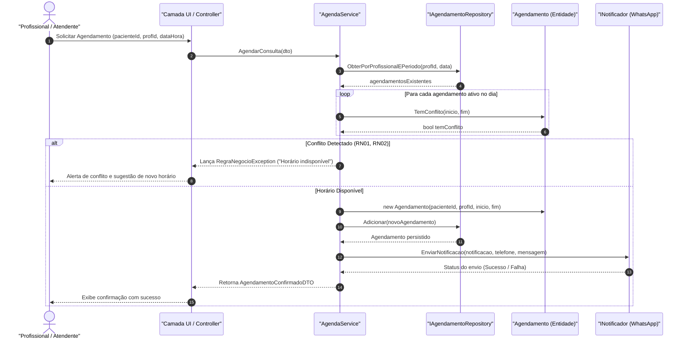

# Software Design Document (SDD)
## Sistema de Agendamento e Prontuário para Clínicas Pequenas

> **Documento de Arquitetura e Design de Software (Fase POO e Integração)**  
> **Autor:** Davi Felinto — Engenharia de Software (CEUB)  
> **Referência de Requisitos:** [`Documento_Especificacao_Requisitos_Final.docx`](../requisitos/Documento_Especificacao_Requisitos_Final.docx)  
> **Modelagem Visual:** [`diagrama_classes.svg`](../diagramas/diagrama_classes.svg)  
> **Data:** Outubro / 2026 — Versão: 1.0

---

## 1. Introdução e Visão Geral

### 1.1 Propósito
Este **Software Design Document (SDD)** especifica a arquitetura técnica, o design orientado a objetos e os padrões de projeto que guiam a implementação do **Sistema de Agendamento e Prontuário para Clínicas Pequenas**.

O documento traduz os requisitos levantados e validados na fase de Engenharia de Requisitos (`RF01–RF28`, `RN01–RN17`, `RQ01–RQ16`) em uma solução de software robusta, escalável e de fácil manutenção.

### 1.2 O Papel no Projeto Integrador Multidisciplinar
O projeto atua como o elo central entre quatro disciplinas da graduação em Engenharia de Software:

```
  ┌─────────────────────────────────────────────────────────────┐
  │                 1. Engenharia de Requisitos                │
  │     (Documento de Especificação de Requisitos - Concluído)  │
  └──────────────────────────────┬──────────────────────────────┘
                                 │
                                 ▼
  ┌─────────────────────────────────────────────────────────────┐
  │         2. Programação Orientada a Objetos (C# / .NET)      │
  │  (Fase Atual: Domínio, Regras de Negócio, 4 Pilares e SDD)   │
  └──────────────────────────────┬──────────────────────────────┘
                                 │
                 ┌───────────────┴───────────────┐
                 ▼                               ▼
  ┌──────────────────────────────┐ ┌────────────────────────────┐
  │    3. Banco de Dados II      │ │ 4. Desenv. de Interface    │
  │  (Modelagem & MySQL Relac.)  │ │   (Web: HTML5, CSS3, JS)   │
  └──────────────┬───────────────┘ └─────────────┬──────────────┘
                 │                               │
                 └───────────────┬───────────────┘
                                 ▼
  ┌─────────────────────────────────────────────────────────────┐
  │                   5. Integração Completa                    │
  │        (API C# consumida por Front Web e persistida em MySQL│
  └─────────────────────────────────────────────────────────────┘
```

### 1.3 Premissa Fundamental de Arquitetura (Zero Retrabalho)
Considerando que:
1. **O professor de POO** valoriza arquiteturas modernas e funcionais (não limitadas a aplicações de terminal "tela preta");
2. **A interface** será construída em tecnologias Web (HTML, CSS, JavaScript com transição para frameworks);
3. **O banco de dados** em BD II será o **MySQL**;

A arquitetura deste sistema adota o **Padrão em Camadas (Layered Architecture / Clean Architecture simplificada)** com **Inversão de Dependência**. As entidades e regras de negócio são **completamente agnósticas** de banco de dados e de telas.

---

## 2. Visão Geral da Arquitetura

O sistema é dividido em 4 camadas bem delimitadas:



### 2.1 Descrição das Camadas

1. **`Domain` (Domínio):** O núcleo da POO. Contém as classes de negócio puras, sem referências externas. Aplica regras intrínsecas e protege as invariantes dos dados.
2. **`Services` (Aplicação / Negócio):** Orquestra fluxos que envolvem múltiplas entidades, persistência e validações cruzadas (ex: verificar se já existe agendamento no mesmo horário antes de salvar).
3. **`Infrastructure` (Persistência e Conectores):**
   - **Na fase de POO:** Implementações em memória usando coleções genéricas `List<T>` com LINQ.
   - **Na fase de BD II:** Troca-se a implementação para repositórios que executam comandos SQL no MySQL, sem tocar no Domínio nem nos Serviços.
4. **`Presentation / API`:** Endpoints REST que recebem requisições HTTP do front-end Web, chamam os serviços e retornam JSON.

---

## 3. Design Orientado a Objetos (Classes e Pilares de POO)

A modelagem de classes foi desenhada para aplicar os **quatro pilares da Orientação a Objetos** de maneira pragmática e elegante.


### 3.1 Os Quatro Pilares da POO no Sistema

#### 1. Abstração
- **`Usuario` (Classe Abstrata):** Modela as características essenciais comuns a qualquer usuário do sistema, impedindo instâncias diretas de um "usuário genérico".
- **`INotificador` (Interface):** Abstrai o ato de enviar notificações, desacoplando as regras de agendamento de canais específicos (WhatsApp, E-mail ou SMS).
- **`IRepository<T>` (Interfaces de Persistência):** Abstraem o acesso e armazenamento de dados.

#### 2. Encapsulamento
- Propriedades com getters públicos e **setters privados (`private set`)**, garantindo que nenhum estado de entidade seja modificado ilegalmente de fora.
- Operações de negócio expostas através de métodos ricos com validação de invariantes:
  - `Paciente.InativarComAnonimizacao()`
  - `Agendamento.Cancelar(DateTime momento)`
  - `SessaoProntuario.AlterarAnotacao(novoTexto, motivo)`

#### 3. Herança
- `ProfissionalSaude` e `Administrador` herdam diretamente de `Usuario`. Reaproveitam propriedades de autenticação e identificação, estendendo campos específicos (registro profissional, nível de auditoria).

#### 4. Polimorfismo
- Implementação de `INotificador`: a classe `NotificadorWhatsApp` implementa o contrato `EnviarNotificacao`. O serviço de agendamento dispara a mensagem sem saber qual classe concreta está executando o envio.
- Implementação dos Repositórios: os serviços dependem de `IPacienteRepository`, que no momento de POO aponta para `InMemoryPacienteRepository` e futuramente em BD II apontará para `MySqlPacienteRepository`.

### 3.2 Diagramas de Sequência UML (Fluxos Críticos de Negócio)

Os diagramas a seguir representam a dinâmica temporal e a troca de mensagens entre os objetos do sistema nos dois fluxos mais sensíveis do domínio.

#### Fluxo Crítico 1: Agendamento com Verificação de Conflito e Notificação (RN01, RN02, RN03, RN04)

Este fluxo demonstra a orquestração do serviço de agendamento, a proteção da regra de invariância de horário na entidade `Agendamento` e o disparo desacoplado de notificação:



#### Fluxo Crítico 2: Atendimento Clínico e Alteração de Prontuário com Histórico Imutável (RN05, RN06, RN13, RN17, RQ07)

Este fluxo modela o ciclo de vida do prontuário: a criação de snapshots imutáveis em cada alteração clínica e a geração obrigatória de trilha de auditoria para conformidade com a LGPD:

```mermaid
sequenceDiagram
    autonumber
    actor Med as "Profissional de Saúde"
    participant UI as "Camada UI / Controller"
    participant Serv as "ProntuarioService"
    participant Repo as "IProntuarioRepository"
    participant Sessao as "SessaoProntuario (Entidade)"
    participant Versao as "VersaoAnotacao (Snapshot)"
    participant Log as "ILogRepository (Auditoria LGPD)"

    Med->>UI: Editar Anotação Clínica (sessaoId, novoTexto, motivo)
    UI->>Serv: AtualizarAnotacao(sessaoId, novoTexto, motivo, usuarioId)
    Serv->>Repo: ObterPorId(sessaoId)
    Repo-->>Serv: sessaoExistente

    Serv->>Sessao: AlterarAnotacao(novoTexto, motivo)
    create participant Versao
    Sessao->>Versao: new VersaoAnotacao(textoAnterior, DateTime.Now, motivo)
    Sessao->>Sessao: HistoricoVersoes.Add(versao)
    Sessao->>Sessao: AnotacoesClinicas = novoTexto

    Serv->>Repo: Atualizar(sessaoExistente)
    Repo-->>Serv: Prontuário persistido com versão arquivada

    Serv->>Log: RegistrarLog(usuarioId, "EDICAO_PRONTUARIO", sessaoId)
    Log-->>Serv: Log gravado

    Serv-->>UI: Retorna SessaoAtualizadaDTO
    UI-->>Med: Confirmação de edição com integridade preservada
```

---

## 4. Padrões de Projeto (Design Patterns)

### 4.1 Repository Pattern (Padrão Repositório)
Isola completamente as classes de domínio e serviços de como os dados são guardados.
```csharp
public interface IPacienteRepository
{
    Paciente? ObterPorId(int id);
    Paciente? ObterPorDocumento(string documento);
    IEnumerable<Paciente> ListarTodos(bool apenasAtivos = true);
    void Adicionar(Paciente paciente);
    void Atualizar(Paciente paciente);
}
```
* **Fase POO:** Implementado por `InMemoryPacienteRepository` usando `List<Paciente>` e consultas LINQ (`.FirstOrDefault()`, `.Where()`).
* **Fase BD II:** Implementado por `MySqlPacienteRepository` usando comandos SQL (`SELECT`, `INSERT`, `UPDATE`).

### 4.2 Service Layer Pattern (Camada de Serviços)
Centraliza a lógica de negócio de aplicação e garante orquestração transacional. Evita "Controladores Gordos" (*Fat Controllers*) e mantém as entidades enxutas.
- `AgendaService`: coordena verificação de choques de horário, persistência de agendamentos e disparo de confirmações.
- `ProntuarioService`: valida se a consulta já foi realizada antes de liberar a anotação clínica.

### 4.3 Strategy / Adapter Pattern (Notificações)
O envio de mensagens é encapsulado pela interface `INotificador`. O canal atual é WhatsApp (`NotificadorWhatsApp`), mas se a clínica quiser enviar por E-mail no futuro, basta criar `NotificadorEmail : INotificador` sem tocar na regra de agendamento.

---

## 5. Matriz de Rastreabilidade (Requisitos → POO)

A tabela a seguir comprova como cada Requisito Funcional (RF), Regra de Negócio (RN) e Requisito de Qualidade (RQ) é atendido no código C#:

| Requisito / Regra | Descrição Sumária | Classe C# Responsável | Método / Elemento de Código |
| :--- | :--- | :--- | :--- |
| **RF01–RF05** | CRUD e busca de Pacientes | `Paciente`, `IPacienteRepository` | `Adicionar()`, `ObterPorDocumento()` |
| **RF06–RF11** | Agendamento e bloqueio | `Agendamento`, `AgendaService` | `Agendar()`, `BloquearHorario()` |
| **RF12–RF14** | Notificações e lembretes | `Notificacao`, `INotificador` | `EnviarNotificacao()`, `PodeReenviar()` |
| **RF15–RF18** | Prontuário e histórico | `SessaoProntuario`, `VersaoAnotacao` | `RegistrarSessao()`, `AlterarAnotacao()` |
| **RF19–RF22** | Financeiro e pendências | `Pagamento`, `FinanceiroService` | `RegistrarPagamento()`, `GerarResumoMensal()` |
| **RF26–RF28** | Autenticação, perfis e logs | `Usuario`, `LogAcesso`, `AuthService` | `Autenticar()`, `RegistrarLog()` |
| **RN01, RN02** | Verificação de conflito de horário | `Agendamento` | `TemConflito(DateTime inicio, DateTime fim)` |
| **RN03, RN04** | Confirmação e lembrete automático 24h | `AgendaService` | `ProgramarNotificacoes(Agendamento ag)` |
| **RN05, RN06** | Prontuário registrado pós-atendimento | `ProntuarioService` | `RegistrarAtendimento(sessao)` |
| **RN07, RN08** | Pagamento pendente até quitação | `Pagamento` | `RegistrarPagamento(FormaPagamento)` |
| **RN09** | Resumo financeiro mensal | `FinanceiroService` | `ObterRelatorioMensal(mes, ano)` |
| **RN10** | Cancelamento tardio (< 24h) | `Agendamento` | `Cancelar(DateTime momentoCancelamento)` |
| **RN11, RN12** | Isolamento de perfil (Profissional vs Admin) | `AuthService`, `SessaoUsuario` | Filtro `ProfissionalId == usuario.Id` |
| **RN13, RQ07**| Log de auditoria em dados de prontuário | `LogAcesso`, `ProntuarioService` | `ILogRepository.Salvar(LogAcesso)` |
| **RN14, RN15**| Retentativa de notificação (1x após 15 min) | `Notificacao` | `PodeReenviar()`, `RegistrarFalha()` |
| **RN16, RQ03**| Inativação lógica com anonimização (LGPD) | `Paciente` | `InativarComAnonimizacao()` |
| **RN17** | Histórico imutável de edições no prontuário | `SessaoProntuario` | `AlterarAnotacao(novoTexto, motivo)` |
| **RQ08** | Senha armazenada com Hash seguro | `Usuario` / `CriptografiaUtil` | `CriptografiaUtil.GerarHash(senha)` |

---

## 6. Estratégia de Transição para Banco de Dados II (MySQL)

A modelagem de entidades do domínio POO mapeia de forma direta (1:1) para o modelo relacional SQL que será elaborado na disciplina de BD II:

| Entidade C# (POO) | Tabela Relacional (MySQL) | Chave Primária (PK) | Chaves Estrangeiras (FK) |
| :--- | :--- | :--- | :--- |
| `Usuario` / Subclasses | `usuarios` | `id_usuario` | — |
| `Paciente` | `pacientes` | `id_paciente` | — |
| `Agendamento` | `agendamentos` | `id_agendamento` | `id_paciente`, `id_profissional` |
| `SessaoProntuario` | `sessoes_prontuario` | `id_sessao` | `id_paciente`, `id_agendamento` |
| `VersaoAnotacao` | `historico_versoes_prontuario` | `id_versao` | `id_sessao` |
| `Pagamento` | `pagamentos` | `id_pagamento` | `id_agendamento` |
| `Notificacao` | `notificacoes` | `id_notificacao` | `id_agendamento` |
| `LogAcesso` | `logs_acesso` | `id_log` | `id_usuario` |

Quando chegar a disciplina de Banco de Dados II:
1. Criam-se os scripts DDL (`CREATE TABLE ...`) no MySQL.
2. Cria-se o projeto `Clinica.Infrastructure.Database` implementando as mesmas interfaces (`IPacienteRepository`, etc.) via ADO.NET / Dapper.
3. Altera-se apenas a linha de injeção de dependência na inicialização da aplicação:
   ```csharp
   // De:
   builder.Services.AddSingleton<IPacienteRepository, InMemoryPacienteRepository>();
   // Para:
   builder.Services.AddScoped<IPacienteRepository, MySqlPacienteRepository>();
   ```
   **Resultado:** 100% das regras de negócio de POO permanecem intactas!

---

## 7. Estratégia de Transição para Desenvolvimento de Interface (Web)

Para alimentar a interface em HTML5, CSS3 e JavaScript:
1. O backend em C# expõe endpoints HTTP claros e padronizados em JSON:
   - `POST /api/auth/login` (Autenticação)
   - `GET /api/pacientes` e `POST /api/pacientes` (Cadastro e listagem)
   - `GET /api/agendamentos` e `POST /api/agendamentos` (Agenda)
   - `POST /api/prontuario` (Registro clínico)
   - `GET /api/financeiro/resumo` (Resumo mensal)
2. No front-end Web, as requisições são feitas via `fetch()` assíncrono padrão do JavaScript.
3. Para a demonstração do professor de POO, pode-se tanto subir a API e abrir o front-end Web no navegador, quanto rodar um módulo CLI interativo que executa os mesmos serviços.

---

## 8. Estrutura Física da Solução C# (.NET)

A solução será organizada no diretório `src/` com a seguinte árvore estrutural:

```
src/
└── ClinicaApp/
    ├── ClinicaApp.sln
    └── ClinicaApp/
        ├── Domain/                     # POO Pura
        │   ├── Entities/
        │   │   ├── Usuario.cs
        │   │   ├── ProfissionalSaude.cs
        │   │   ├── Administrador.cs
        │   │   ├── Paciente.cs
        │   │   ├── Agendamento.cs
        │   │   ├── SessaoProntuario.cs
        │   │   ├── VersaoAnotacao.cs
        │   │   ├── Pagamento.cs
        │   │   ├── Notificacao.cs
        │   │   └── LogAcesso.cs
        │   ├── Enums/
        │   │   ├── PerfilUsuario.cs
        │   │   ├── StatusAgendamento.cs
        │   │   ├── StatusPagamento.cs
        │   │   ├── FormaPagamento.cs
        │   │   ├── TipoNotificacao.cs
        │   │   └── CanalNotificacao.cs
        │   └── Interfaces/
        │       ├── IPacienteRepository.cs
        │       ├── IAgendamentoRepository.cs
        │       ├── IProntuarioRepository.cs
        │       ├── IPagamentoRepository.cs
        │       ├── IUsuarioRepository.cs
        │       └── INotificador.cs
        ├── Services/                   # Regras de Negócio e Casos de Uso
        │   ├── AuthService.cs
        │   ├── AgendaService.cs
        │   ├── ProntuarioService.cs
        │   ├── FinanceiroService.cs
        │   └── NotificacaoService.cs
        ├── Infrastructure/             # Persistência e Implementações
        │   ├── InMemory/
        │   │   ├── InMemoryPacienteRepository.cs
        │   │   ├── InMemoryAgendamentoRepository.cs
        │   │   ├── InMemoryProntuarioRepository.cs
        │   │   ├── InMemoryPagamentoRepository.cs
        │   │   └── InMemoryUsuarioRepository.cs
        │   └── External/
        │       └── NotificadorWhatsApp.cs
        ├── Common/                     # Utilitários globais
        │   ├── CriptografiaUtil.cs
        │   └── SessaoUsuario.cs
        ├── Presentation/               # API / Controladores e Execução
        │   └── Program.cs
        └── ClinicaApp.csproj
    └── ClinicaApp.Tests/               # Suíte de Testes Automatizados (TDD / xUnit)
        ├── Domain/
        │   ├── PacienteTests.cs        # Validações, inativação e anonimização (RN16, RQ03)
        │   ├── AgendamentoTests.cs     # Conflito de horários e cancelamento tardio (RN01, RN10)
        │   ├── SessaoProntuarioTests.cs# Versionamento e imutabilidade de anotações (RN17)
        │   └── PagamentoTests.cs       # Quitação e status financeiro (RN07, RN08)
        ├── Services/
        │   ├── AgendaServiceTests.cs   # Orquestração de agendamento e notificações
        │   └── AuthServiceTests.cs     # Autenticação e hash de senhas (RQ08)
        └── ClinicaApp.Tests.csproj
```

---

## 9. Metodologia de Desenvolvimento: TDD (Test-Driven Development)

Para assegurar confiabilidade máxima, conformidade com os requisitos de qualidade (**RQ12, RQ14, RQ16**) e demonstrar rigor de engenharia de software na disciplina de POO, o sistema adota a metodologia **TDD (Test-Driven Development)** utilizando o framework **xUnit**.

### 9.1 Ciclo Red-Green-Refactor

Cada entidade de domínio e regra de negócio é desenvolvida estritamente seguindo o ciclo:

1. **🔴 Red (Escrever o teste primeiro):**
   - Cria-se um método de teste em `ClinicaApp.Tests` especificando o comportamento esperado de um requisito (ex.: `Deve_Marcar_Cancelamento_Como_Tardio_Quando_Menor_Que_24_Horas()`).
   - O teste falha inicialmente (ou nem compila), pois o código de produção correspondente ainda não existe ou não possui a regra.
2. **🟢 Green (Implementar o código mínimo):**
   - No projeto `ClinicaApp`, implementa-se a quantidade mínima de código necessária para fazer o teste passar.
   - Executa-se `dotnet test` para validar o sucesso da suíte.
3. **🔵 Refactor (Aperfeiçoar com segurança):**
   - O código é refatorado para aplicar boas práticas de POO (Clean Code, encapsulamento adequado, nomes expressivos e redução de redundâncias), mantendo todos os testes verdes.

### 9.2 Matriz de Cobertura de Testes Prioritários (TDD)

| Teste Automatizado | Regra / Requisito Coberto | Cenário Validado |
| :--- | :--- | :--- |
| `PacienteTests.InativarComAnonimizacao_DeveLimparDadosPessoais()` | RN16, RQ03 | Ao inativar paciente, `Ativo` torna-se `false` e dados sensíveis (e-mail, telefone) são mascarados/limpos. |
| `AgendamentoTests.TemConflito_ComSobreposicaoHorario_DeveRetornarTrue()` | RN01, RN02 | Detecta conflito se uma nova consulta coincidir com o intervalo de outra confirmada. |
| `AgendamentoTests.Cancelar_ComMenosDe24Horas_DeveMarcarCancelamentoTardio()` | RN10 | Marca a flag `CancelamentoTardio = true` quando a solicitação ocorre a menos de 24h da consulta. |
| `SessaoProntuarioTests.AlterarAnotacao_DeveRegistrarVersaoAnterior()` | RN17 | Ao alterar uma anotação, a versão anterior é salva no histórico imutável com data e motivo. |
| `NotificacaoTests.PodeReenviar_ApenasUmaTentativaApos15Minutos()` | RN14, RN15 | Garante que apenas 1 nova tentativa seja autorizada após 15 minutos de falha. |
| `UsuarioTests.Autenticar_ComSenhaIncorreta_DeveRetornarFalse()` | RF26, RQ08 | Garante validação segura com hash sem expor senhas em texto puro. |

---

## 10. Conclusão e Próximos Passos

Com este **Software Design Document (SDD)** devidamente formalizado:
1. O escopo técnico está completamente alinhado aos requisitos aprovados;
2. As decisões arquiteturais protegem contra retrabalhos futuros nas disciplinas de Banco de Dados II e Desenvolvimento de Interface;
3. A metodologia TDD garante que cada linha de POO nasça acompanhada de sua validação automatizada.

**Próximo Passo Imediato:**
Inicializar a solução .NET em `src/` contendo os dois projetos (`ClinicaApp` e `ClinicaApp.Tests`), configurando a suíte xUnit para iniciarmos o ciclo TDD da primeira entidade (`Paciente.cs`).
