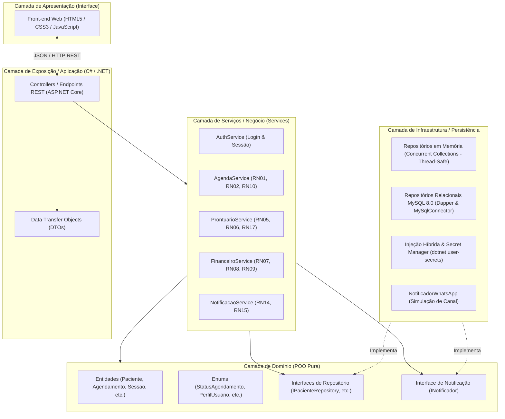
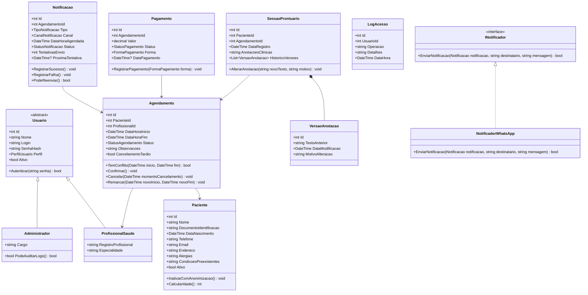
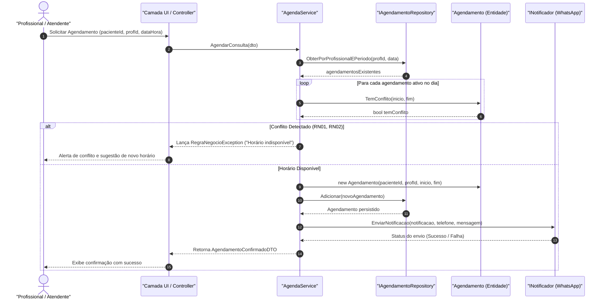

# Software Design Document (SDD)
## Sistema de Agendamento e Prontuário para Clínicas Pequenas (Clinix)

> **Documento de Arquitetura e Design de Software (Versão 2.0 — Integração Full-Stack)**  
> **Autor:** Davi Felinto — Engenharia de Software (CEUB)  
> **Referência de Requisitos:** [`docs/requisitos/README.md`](../requisitos/README.md)  
> **Modelagem Visual:** [`diagrama_classes.svg`](../diagramas/diagrama_classes.svg)  
> **Data:** Outubro / 2026 — Versão: 2.0 (POO C# + Banco de Dados II MySQL + API REST + Web MVP)

---

## 1. Introdução e Visão Geral

### 1.1 Propósito
Este **Software Design Document (SDD)** especifica a arquitetura técnica, o design orientado a objetos, a modelagem relacional e os padrões de projeto que regem a implementação do **Sistema de Agendamento e Prontuário para Clínicas Pequenas (Clinix)**.

O documento formaliza como os requisitos levantados (`RF01–RF28`, `RN01–RN17`, `RQ01–RQ16`) foram consolidados em uma solução de software robusta, desacoplada, segura e em estrita conformidade com a LGPD.

### 1.2 O Papel no Projeto Integrador Multidisciplinar
O projeto integra harmonicamente as competências de quatro disciplinas da graduação em Engenharia de Software do CEUB:

```
  ┌─────────────────────────────────────────────────────────────┐
  │                 1. Engenharia de Requisitos                │
  │     (Documento de Requisitos: 28 RFs, 17 RNs, 16 RQs)       │
  │                       [✅ CONCLUÍDO]                        │
  └──────────────────────────────┬──────────────────────────────┘
                                 │
                                 ▼
  ┌─────────────────────────────────────────────────────────────┐
  │         2. Programação Orientada a Objetos (C# / .NET 8)    │
  │       (Domínio Rico, 4 Pilares, TDD xUnit - 52 testes)      │
  │                       [✅ CONCLUÍDO]                        │
  └──────────────────────────────┬──────────────────────────────┘
                                 │
                 ┌───────────────┴───────────────┐
                 ▼                               ▼
  ┌──────────────────────────────┐ ┌────────────────────────────┐
  │    3. Banco de Dados II      │ │ 4. Desenv. de Interface    │
  │ (MySQL 8.0, 15 tabelas, 3FN, │ │ (Web Responsivo, HTML5,    │
  │   Repositórios Dapper C#)    │ │  TailwindCSS, React, PWA)  │
  │        [✅ CONCLUÍDO]         │ │        [✅ CONCLUÍDO]       │
  └──────────────┬───────────────┘ └─────────────┬──────────────┘
                 │                               │
                 └───────────────┬───────────────┘
                                 ▼
  ┌─────────────────────────────────────────────────────────────┐
  │              5. Solução Integrada e Entregue                │
  │ (ASP.NET Core Web API com DI Híbrida, Dapper, Docker e Web) │
  │                       [✅ CONCLUÍDO]                        │
  └─────────────────────────────────────────────────────────────┘
```

### 1.3 Premissa Fundamental de Arquitetura (Zero Retrabalho)
Considerando que:
1. **O professor de POO** valoriza arquiteturas modernas e funcionais (não limitadas a aplicações de terminal "tela preta");
2. **A interface** será construída em tecnologias Web (HTML, CSS, JavaScript com transição para frameworks);
3. **O banco de dados** em BD II será o **MySQL**;

A arquitetura deste sistema adota o **Padrão em Camadas (Layered Architecture / Clean Architecture simplificada)** com **Inversão de Dependência**. As entidades e regras de negócio são **completamente agnósticas** de banco de dados e de telas.

---

## 2. Visão Geral da Arquitetura

O sistema é dividido em 4 camadas bem delimitadas:



### 2.1 Descrição das Camadas

1. **`Domain` (Domínio):** O núcleo da POO. Contém as classes de negócio puras, sem referências externas. Aplica regras intrínsecas e protege as invariantes dos dados com encapsulamento estrito (`private set`).
2. **`Services` (Aplicação / Negócio):** Orquestra fluxos que envolvem múltiplas entidades, persistência e validações cruzadas (ex: verificar conflito de horário `RN01/RN02` e aplicar cancelamento tardio `RN10`).
3. **`Infrastructure` (Persistência e Conectores):**
   - **`ClinicaApp.Infrastructure.InMemory`:** Coleções thread-safe para testes automatizados rápidos e desenvolvimento ágil de front-end.
   - **`ClinicaApp.Infrastructure.MySQL`:** Implementação relacional de alta performance via **Dapper**, mapeando as 15 tabelas em 3ª Forma Normal.
   - **Injeção Híbrida (`Program.cs`):** Alternância automática em tempo de execução via connection string protegida com `dotnet user-secrets`.
4. **`Presentation / API` (`ClinicaApp.Api`):** Endpoints REST em ASP.NET Core (.NET 8) que expõem recursos JSON e servem a interface Web integrada (`wwwroot/index.html`).

---

## 3. Design Orientado a Objetos (Classes e Pilares de POO)

A modelagem de classes foi desenhada para aplicar os **quatro pilares da Orientação a Objetos** de maneira pragmática e elegante.



### 3.1 Os Quatro Pilares da POO no Sistema

#### 1. Abstração
- **`Usuario` (Classe Abstrata):** Modela as características essenciais comuns a qualquer usuário do sistema, impedindo instâncias diretas de um "usuário genérico".
- **`INotificador` (Interface):** Abstrai o ato de enviar notificações, desacoplando as regras de agendamento de canais específicos (WhatsApp, E-mail ou SMS).
- **`IRepository<T>` (Interfaces de Persistência):** Abstraem o acesso e armazenamento de dados.

#### 2. Encapsulamento
- Propriedades com getters públicos e **setters privados (`private set`)**, garantindo que nenhum estado de entidade seja modificado ilegalmente de fora.
- Operações de negócio expostas através de métodos ricos com validação de invariantes:
  - `Paciente.InativarComAnonimizacao()`
  - `Agendamento.Cancelar(DateTime momento)`
  - `SessaoProntuario.AlterarAnotacao(novoTexto, motivo)`

#### 3. Herança
- `ProfissionalSaude` e `Administrador` herdam diretamente de `Usuario`. Reaproveitam propriedades de autenticação e identificação, estendendo campos específicos (registro profissional, nível de auditoria).

#### 4. Polimorfismo
- Implementação de `INotificador`: a classe `NotificadorWhatsApp` implementa o contrato `EnviarNotificacao`. O serviço de agendamento dispara a mensagem sem saber qual classe concreta está executando o envio.
- Implementação dos Repositórios: os serviços dependem de `IPacienteRepository`, que no momento de POO aponta para `InMemoryPacienteRepository` e futuramente em BD II apontará para `MySqlPacienteRepository`.

### 3.2 Diagramas de Sequência UML (Fluxos Críticos de Negócio)

Os diagramas a seguir representam a dinâmica temporal e a troca de mensagens entre os objetos do sistema nos dois fluxos mais sensíveis do domínio.

#### Fluxo Crítico 1: Agendamento com Verificação de Conflito e Notificação (RN01, RN02, RN03, RN04)

Este fluxo demonstra a orquestração do serviço de agendamento, a proteção da regra de invariância de horário na entidade `Agendamento` e o disparo desacoplado de notificação:



#### Fluxo Crítico 2: Atendimento Clínico e Alteração de Prontuário com Histórico Imutável (RN05, RN06, RN13, RN17, RQ07)

Este fluxo modela o ciclo de vida do prontuário: a criação de snapshots imutáveis em cada alteração clínica e a geração obrigatória de trilha de auditoria para conformidade com a LGPD:

```mermaid
sequenceDiagram
    autonumber
    actor Med as "Profissional de Saúde"
    participant UI as "Camada UI / Controller"
    participant Serv as "ProntuarioService"
    participant Repo as "IProntuarioRepository"
    participant Sessao as "SessaoProntuario (Entidade)"
    participant Versao as "VersaoAnotacao (Snapshot)"
    participant Log as "ILogRepository (Auditoria LGPD)"

    Med->>UI: Editar Anotação Clínica (sessaoId, novoTexto, motivo)
    UI->>Serv: AtualizarAnotacao(sessaoId, novoTexto, motivo, usuarioId)
    Serv->>Repo: ObterPorId(sessaoId)
    Repo-->>Serv: sessaoExistente

    Serv->>Sessao: AlterarAnotacao(novoTexto, motivo)
    create participant Versao
    Sessao->>Versao: new VersaoAnotacao(textoAnterior, DateTime.Now, motivo)
    Sessao->>Sessao: HistoricoVersoes.Add(versao)
    Sessao->>Sessao: AnotacoesClinicas = novoTexto

    Serv->>Repo: Atualizar(sessaoExistente)
    Repo-->>Serv: Prontuário persistido com versão arquivada

    Serv->>Log: RegistrarLog(usuarioId, "EDICAO_PRONTUARIO", sessaoId)
    Log-->>Serv: Log gravado

    Serv-->>UI: Retorna SessaoAtualizadaDTO
    UI-->>Med: Confirmação de edição com integridade preservada
```

---

## 4. Padrões de Projeto (Design Patterns)

### 4.1 Repository Pattern (Padrão Repositório)
Isola completamente as classes de domínio e serviços de como os dados são guardados.
```csharp
public interface IPacienteRepository
{
    Paciente? ObterPorId(int id);
    Paciente? ObterPorDocumento(string documento);
    IEnumerable<Paciente> ListarTodos(bool apenasAtivos = true);
    void Adicionar(Paciente paciente);
    void Atualizar(Paciente paciente);
}
```
* **Fase POO:** Implementado por `InMemoryPacienteRepository` usando `List<Paciente>` e consultas LINQ (`.FirstOrDefault()`, `.Where()`).
* **Fase BD II:** Implementado por `MySqlPacienteRepository` usando comandos SQL (`SELECT`, `INSERT`, `UPDATE`).

### 4.2 Service Layer Pattern (Camada de Serviços)
Centraliza a lógica de negócio de aplicação e garante orquestração transacional. Evita "Controladores Gordos" (*Fat Controllers*) e mantém as entidades enxutas.
- `AgendaService`: coordena verificação de choques de horário, persistência de agendamentos e disparo de confirmações.
- `ProntuarioService`: valida se a consulta já foi realizada antes de liberar a anotação clínica.

### 4.3 Strategy / Adapter Pattern (Notificações)
O envio de mensagens é encapsulado pela interface `INotificador`. O canal atual é WhatsApp (`NotificadorWhatsApp`), mas se a clínica quiser enviar por E-mail no futuro, basta criar `NotificadorEmail : INotificador` sem tocar na regra de agendamento.

---

## 5. Matriz de Rastreabilidade (Requisitos → POO)

A tabela a seguir comprova como cada Requisito Funcional (RF), Regra de Negócio (RN) e Requisito de Qualidade (RQ) é atendido no código C#:

| Requisito / Regra | Descrição Sumária | Classe C# Responsável | Método / Elemento de Código |
| :--- | :--- | :--- | :--- |
| **RF01–RF05** | CRUD e busca de Pacientes | `Paciente`, `IPacienteRepository` | `Adicionar()`, `ObterPorDocumento()` |
| **RF06–RF11** | Agendamento e bloqueio | `Agendamento`, `AgendaService` | `Agendar()`, `BloquearHorario()` |
| **RF12–RF14** | Notificações e lembretes | `Notificacao`, `INotificador` | `EnviarNotificacao()`, `PodeReenviar()` |
| **RF15–RF18** | Prontuário e histórico | `SessaoProntuario`, `VersaoAnotacao` | `RegistrarSessao()`, `AlterarAnotacao()` |
| **RF19–RF22** | Financeiro e pendências | `Pagamento`, `FinanceiroService` | `RegistrarPagamento()`, `GerarResumoMensal()` |
| **RF26–RF28** | Autenticação, perfis e logs | `Usuario`, `LogAcesso`, `AuthService` | `Autenticar()`, `RegistrarLog()` |
| **RN01, RN02** | Verificação de conflito de horário | `Agendamento` | `TemConflito(DateTime inicio, DateTime fim)` |
| **RN03, RN04** | Confirmação e lembrete automático 24h | `AgendaService` | `ProgramarNotificacoes(Agendamento ag)` |
| **RN05, RN06** | Prontuário registrado pós-atendimento | `ProntuarioService` | `RegistrarAtendimento(sessao)` |
| **RN07, RN08** | Pagamento pendente até quitação | `Pagamento` | `RegistrarPagamento(FormaPagamento)` |
| **RN09** | Resumo financeiro mensal | `FinanceiroService` | `ObterRelatorioMensal(mes, ano)` |
| **RN10** | Cancelamento tardio (< 24h) | `Agendamento` | `Cancelar(DateTime momentoCancelamento)` |
| **RN11, RN12** | Isolamento de perfil (Profissional vs Admin) | `AuthService`, `SessaoUsuario` | Filtro `ProfissionalId == usuario.Id` |
| **RN13, RQ07**| Log de auditoria em dados de prontuário | `LogAcesso`, `ProntuarioService` | `ILogRepository.Salvar(LogAcesso)` |
| **RN14, RN15**| Retentativa de notificação (1x após 15 min) | `Notificacao` | `PodeReenviar()`, `RegistrarFalha()` |
| **RN16, RQ03**| Inativação lógica com anonimização (LGPD) | `Paciente` | `InativarComAnonimizacao()` |
| **RN17** | Histórico imutável de edições no prontuário | `SessaoProntuario` | `AlterarAnotacao(novoTexto, motivo)` |
| **RQ08** | Senha armazenada com Hash seguro | `Usuario` / `CriptografiaUtil` | `CriptografiaUtil.GerarHash(senha)` |

---

## 6. Persistência Relacional com MySQL 8.0 & Dapper (Implementado)

A persistência do sistema evoluiu com sucesso da simulação em memória para um banco de dados relacional **MySQL 8.0** de nível de produção, modelado em estrita **3ª Forma Normal (3FN)**:

### 6.1 Mapeamento Objeto-Relacional (DDD ↔ SQL)
A modelagem de entidades do domínio POO mapeia diretamente para o esquema relacional oficial ([`01_schema_ddl.sql`](../../bancodedadosclinica/01_schema_ddl.sql)):

| Entidade C# (POO) | Tabela Relacional (MySQL) | Chave Primária (PK) | Chaves Estrangeiras (FK) & Índices |
| :--- | :--- | :--- | :--- |
| `Usuario` (Base) | `usuarios` | `id_usuario` | `uq_usuarios_login`, `uq_usuarios_id_perfil` |
| `ProfissionalSaude` | `profissionais_saude` | `id_usuario` | `fk_prof_usuario (id_usuario, perfil)`, `uq_prof_registro` |
| `Administrador` | `administradores` | `id_usuario` | `fk_adm_usuario (id_usuario, perfil)` |
| `Paciente` | `pacientes` | `id_paciente` | `uq_pacientes_documento`, `fk_pacientes_profissional` |
| `Agendamento` | `agendamentos` | `id_agendamento` | `fk_agendamento_paciente`, `fk_agendamento_profissional` |
| `SessaoProntuario` | `sessoes_prontuario` | `id_sessao` | `fk_sessao_paciente`, `fk_sessao_agendamento` |
| `VersaoAnotacao` | `historico_versoes_prontuario` | `id_versao` | `fk_versao_sessao (id_sessao)` |
| `Pagamento` | `pagamentos` | `id_pagamento` | `uq_pagamentos_agendamento (RN07)` |
| `LogAcesso` | `logs_acesso` | `id_log` | `fk_logs_usuario (id_usuario)`, `idx_logs_data` |

### 6.2 Repositórios Relacionais Dapper (`ClinicaApp.Infrastructure.MySQL`)
Optou-se pelo micro-ORM **Dapper** em conjunto com **MySqlConnector** devido à performance máxima e ao controle explícito de consultas SQL parametrizadas (**RQ09 - Prevenção contra SQL Injection**):
1. **`MySqlPacienteRepository`:** Executa CRUD de pacientes e aplica anonimização lógica LGPD (`RN16, RQ03`).
2. **`MySqlAgendamentoRepository`:** Consulta bloqueios de horário (`RN01, RN02`) e marcação de cancelamento tardio (`RN10`).
3. **`MySqlUsuarioRepository`:** Gerencia herança Table-per-Type (TPT) com integridade transacional ACID (`usuarios` + `profissionais_saude`/`administradores`).
4. **`MySqlProntuarioRepository`:** Persiste sessões clínicas e histórico imutável de versões (`RN17, RF16`).
5. **`MySqlPagamentoRepository`:** Garante unicidade de cobrança por consulta (`RN07`) e controle de quitação (`RN08`).
6. **`MySqlLogAcessoRepository`:** Gravação imutável de trilha de auditoria para fins de compliance LGPD (`RF28, RN13, RQ07`).

### 6.3 Injeção de Dependência Híbrida & Gestão Segura de Credenciais
No `Program.cs` da API, adotou-se o padrão de **Injeção Híbrida**:
- Se a connection string `ClinixDb` estiver presente e válida, a API registra os repositórios MySQL em escopo `Scoped`.
- Caso contrário, faz fallback gracioso para os repositórios `InMemory` em escopo `Singleton`.
- Para proteger senhas de banco de dados, utiliza-se o **Secret Manager** (`dotnet user-secrets`), mantendo credenciais fora de arquivos rastreados pelo Git.

### 6.4 Orquestração Conteinerizada (Docker Compose)
O arquivo [`docker-compose.yml`](../../docker-compose.yml) provê um ambiente completo em 1 comando (`docker compose up -d`):
- Container **MySQL 8.0** com inicialização automática dos scripts DDL e Seed via volume `/docker-entrypoint-initdb.d/`.
- Container **API .NET 8** conectada em rede interna ao banco de dados com healthcheck automático.

---

## 7. Camada de Apresentação e Integração Web

### 7.1 ASP.NET Core Web API (`ClinicaApp.Api`)
A exposição de serviços adota o padrão RESTful com endpoints documentados via Swagger:
- **`AuthController`:** `POST /api/auth/login` (autenticação segura e RBAC).
- **`PacientesController`:** `GET /api/pacientes`, `POST /api/pacientes`, `PUT /api/pacientes/{id}`, `DELETE /api/pacientes/{id}` (anonimização LGPD).
- **`AgendamentosController`:** `GET /api/agendamentos`, `POST /api/agendamentos`, `PUT /api/agendamentos/{id}/confirmar`, `PUT /api/agendamentos/{id}/cancelar`.
- **`ProntuariosController`:** `GET /api/prontuarios/{pacienteId}`, `POST /api/prontuarios` (versões imutáveis).
- **`FinanceiroController`:** `GET /api/financeiro/resumo?mes={m}&ano={a}`, `PUT /api/financeiro/{id}/pagar`.

### 7.2 Camada Cliente Front-End (`api.js` & `index.html`)
O frontend web consome os endpoints através de um módulo cliente desacoplado (`api.js`):
- Chamadas assíncronas via `fetch()` com cabeçalhos padronizados `application/json`.
- Captura de exceções de domínio e exibição de alertas amigáveis em tela (**RQ11**).
- Modo Híbrido: se a API estiver offline (como na demonstração do GitHub Pages), a interface alterna automaticamente para armazenamento local em `localStorage`.

---

## 8. Estrutura Física da Solução C# (.NET 8)

A organização no diretório `src/` reflete estritamente a separação em camadas:

```
src/
├── ClinicaApp.slnx                     # Arquivo de Solução (.NET 8)
├── ClinicaApp/                         # Domínio e Infraestrutura
│   ├── Domain/
│   │   ├── Entities/                   # Paciente, Agendamento, SessaoProntuario, Pagamento, etc.
│   │   ├── Enums/                      # StatusAgendamento, PerfilUsuario, FormaPagamento, etc.
│   │   └── Interfaces/                 # IPacienteRepository, IAgendamentoRepository, INotificador, etc.
│   ├── Infrastructure/
│   │   ├── InMemory/                   # Persistência em memória thread-safe (Fallback & Testes)
│   │   ├── MySQL/                      # 6 Repositórios relacionais concretos com Dapper
│   │   └── External/                   # NotificadorWhatsApp (simulação de mensageria externa)
│   └── Services/                       # Application Services com guardiões das Regras de Negócio
│       ├── AuthService.cs              # RF26, RQ08: Autenticação PBKDF2/SHA-256 + Salt
│       ├── AgendaService.cs            # RN01/RN02: Conflitos; RN10: Cancelamento tardio; RF12: WhatsApp
│       ├── ProntuarioService.cs        # RN05, RN17: Histórico imutável; RN13, RQ07: Auditoria LGPD
│       └── FinanceiroService.cs        # RN07: Cobrança sem duplicidade; RN08/RN09: Quitação e fechamento
├── ClinicaApp.Api/                     # Apresentação e API REST
│   ├── Controllers/                    # Endpoints RESTful
│   ├── Data/DadosIniciais.cs           # Seed de dados para modo em memória
│   ├── Program.cs                      # Injeção híbrida, CORS, Swagger e estáticos
│   └── wwwroot/                        # Interface Web distribuída diretamente com a API
├── ClinicaApp.Tests/                   # Suíte de Testes Automatizados (xUnit / TDD)
│   ├── Domain/                         # 23 testes unitários focados nas entidades
│   └── Services/                       # 29 testes unitários dos fluxos de regras de negócio
└── README.md                           # Documentação técnica do código-fonte
```

---

## 9. Metodologia de Desenvolvimento: TDD (Test-Driven Development)

Para assegurar confiabilidade máxima e conformidade com os requisitos de qualidade (**RQ12, RQ13, RQ14**), a suíte automatizada conta com **52 testes unitários** desenvolvidos com **xUnit**:

```bash
dotnet test src/
```
```text
Aprovado!  – Com falha: 0, Aprovado: 52, Ignorado: 0, Total: 52 (100% de sucesso)
```

### 9.1 Matriz de Cobertura de Testes Prioritários (TDD)

| Teste Automatizado | Regra / Requisito Coberto | Cenário Validado | Status |
| :--- | :--- | :--- | :---: |
| `PacienteTests.InativarComAnonimizacao_DeveLimparDadosPessoais()` | RN16, RQ03 | Ao inativar paciente, `Ativo` torna-se `false` e dados sensíveis são anonimizados. | ✅ Aprovado |
| `AgendamentoTests.TemConflito_ComSobreposicaoHorario_DeveRetornarTrue()` | RN01, RN02 | Detecta conflito se nova consulta coincidir com o intervalo de outra confirmada. | ✅ Aprovado |
| `AgendamentoTests.Cancelar_ComMenosDe24Horas_DeveMarcarCancelamentoTardio()` | RN10 | Marca a flag `CancelamentoTardio = true` quando cancelada com menos de 24h. | ✅ Aprovado |
| `SessaoProntuarioTests.AlterarAnotacao_DeveRegistrarVersaoAnterior()` | RN17 | Ao alterar anotação, versão anterior é salva no histórico imutável com justificativa. | ✅ Aprovado |
| `PagamentoTests.RegistrarPagamento_DeveAtualizarStatusParaPagoEData()` | RN07, RN08 | Registra quitação, atualizando status para Pago e gravando forma e timestamp. | ✅ Aprovado |
| `LogAcessoTests.Deve_Criar_Log_Com_Sucesso_E_DataHora_Atual()` | RF28, RN13, RQ07 | Valida criação de logs de auditoria imutáveis com rastreabilidade exigida pela LGPD. | ✅ Aprovado |
| `UsuarioTests.Autenticar_ComSenhaIncorreta_DeveRetornarFalse()` | RF26, RQ08 | Garante validação segura com hash sem expor senhas em texto puro. | ✅ Aprovado |
| `AgendaServiceTests.AgendarConsulta_ComConflito_DeveLancarExcecao()` | RN01, RN02 | AgendaService impede agendamento simultâneo para o mesmo médico. | ✅ Aprovado |
| `FinanceiroServiceTests.GerarCobranca_ConsultaJaComCobranca_DeveLancarExcecao()` | RN07 | Bloqueia duplicidade de cobrança financeira para a mesma consulta. | ✅ Aprovado |

---

## 10. Conclusão e Status Consolidado de Implementação

Todos os módulos planejados no ciclo do Projeto Integrador foram **100% implementados, testados e integrados**:

* **Bloco 1 — Entidades de Domínio e Testes Unitários:** ✅ **100% Concluído** (23 testes xUnit).
* **Bloco 2 — Interfaces e Repositórios In-Memory:** ✅ **100% Concluído** (contratos DDD).
* **Bloco 3 — Serviços de Aplicação e Casos de Uso:** ✅ **100% Concluído** (29 testes xUnit).
* **Bloco 4 — Persistência Relacional MySQL 8.0 & Dapper:** ✅ **100% Concluído** (15 tabelas, 3FN, 6 repositórios concretos Dapper, segredos protegidos).
* **Bloco 5 — ASP.NET Core Web API, Docker e Interface Web:** ✅ **100% Concluído** (Controllers REST, Swagger, modo híbrido, Docker Compose).

