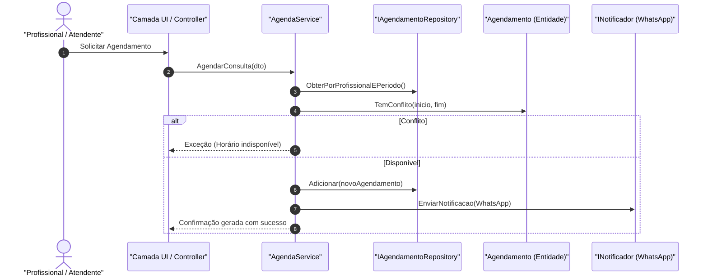
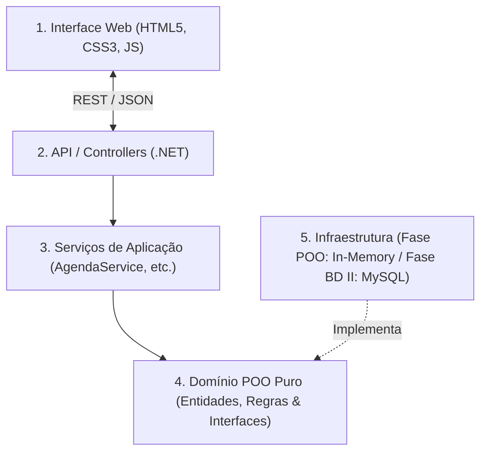
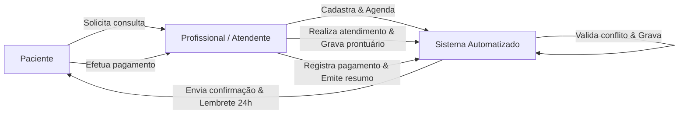

# Catálogo Central de Diagramas do Projeto

> **Sistema de Agendamento e Prontuário para Clínicas Pequenas**  
> Repositório unificado de todos os modelos visuais, arquiteturais e de processos do sistema.

---

## 🗺️ Índice de Diagramas

| # | Diagrama | Tipo / Padrão | Arquivo | Finalidade Principal |
|---|---|---|---|---|
| **1** | [Diagrama de Classes UML](#1-diagrama-de-classes-uml) | UML Estrutural | [`diagrama_classes.svg`](diagrama_classes.svg) / [`.excalidraw`](diagrama_classes.excalidraw) | Modela entidades, atributos, métodos, herança e relações de POO. |
| **2** | [Diagramas de Sequência UML](#2-diagramas-de-sequência-uml-fluxos-críticos) | UML Comportamental | [`diagrama_sequencia.md`](diagrama_sequencia.md) | Troca temporal de mensagens no Agendamento e Prontuário. |
| **3** | [Diagrama de Arquitetura](#3-diagrama-de-arquitetura-do-sistema) | Arquitetura em Camadas | [`diagrama_arquitetura.md`](diagrama_arquitetura.md) | Organização das 4 camadas, isolamento do domínio e desacoplamento. |
| **4** | [Diagrama de Processo TO-BE](#4-diagrama-de-processo-to-be-bpmn) | BPMN / Raias | [`diagrama_bpmn_processo.md`](diagrama_bpmn_processo.md) | Fluxo de negócio de ponta a ponta nas 3 raias (Paciente, Profissional, Sistema). |

---

## 1. Diagrama de Classes UML

Modelagem Orientada a Objetos com aplicação dos quatro pilares (Abstração, Encapsulamento, Herança e Polimorfismo):

> **Edição:** O arquivo nativo [`diagrama_classes.excalidraw`](diagrama_classes.excalidraw) pode ser editado diretamente no [Excalidraw](https://excalidraw.com) ou no VS Code.

### Tabela Resumo das Classes
| Pacote / Domínio | Classe / Interface | Responsabilidade Principal | Requisitos |
| :--- | :--- | :--- | :--- |
| **Segurança & Acesso** | `Usuario` *(abstract)* | Modelo base com ID, nome, login e autenticação com hash. | RF26, RQ08 |
| | `ProfissionalSaude` | Especialização com registro e escopo da própria agenda. | RF27, RN12 |
| | `Administrador` | Especialização com privilégios gerais e auditoria de logs. | RF27, RN12 |
| | `LogAcesso` | Registro imutável de acessos sensíveis a prontuários (LGPD). | RF28, RN13, RQ07 |
| **Paciente** | `Paciente` | Dados cadastrais e inativação com anonimização de dados. | RF01–RF05, RN16, RQ03 |
| **Agendamento** | `Agendamento` | Gerencia horários, verificação de conflitos e cancelamentos tardios. | RF06–RF11, RN01, RN02, RN10 |
| **Prontuário** | `SessaoProntuario` | Anotações clínicas realizadas pelo profissional pós-consulta. | RF15, RF17, RN05, RN06 |
| | `VersaoAnotacao` | Histórico imutável de alterações de anotação de prontuário. | RF16, RN17 |
| **Financeiro** | `Pagamento` | Controle de valor, forma de quitação e status pago/pendente. | RF19–RF22, RN07, RN08 |
| **Notificação** | `Notificacao` | Ciclo de envio de confirmações e lembretes com retentativa. | RF12–RF14, RN03, RN04, RN14 |
| | `INotificador` | Interface de contrato desacoplada do canal de mensageria. | RF12, RF13 |
| | `NotificadorWhatsApp` | Implementação concreta do envio via canal WhatsApp. | RF12, RF13, RN14, RN15 |

---

## 2. Diagramas de Sequência UML (Fluxos Críticos)

Arquivo completo com detalhamento dos passos: [`diagrama_sequencia.md`](diagrama_sequencia.md).

### Prévia do Fluxo de Agendamento com Conflito e Notificação (RN01, RN02, RN03, RN04)

---

## 3. Diagrama de Arquitetura do Sistema

Arquivo completo com explicação de cada camada: [`diagrama_arquitetura.md`](diagrama_arquitetura.md).

---

## 4. Diagrama de Processo TO-BE (BPMN)

Arquivo completo com mapeamento detalhado: [`diagrama_bpmn_processo.md`](diagrama_bpmn_processo.md).

