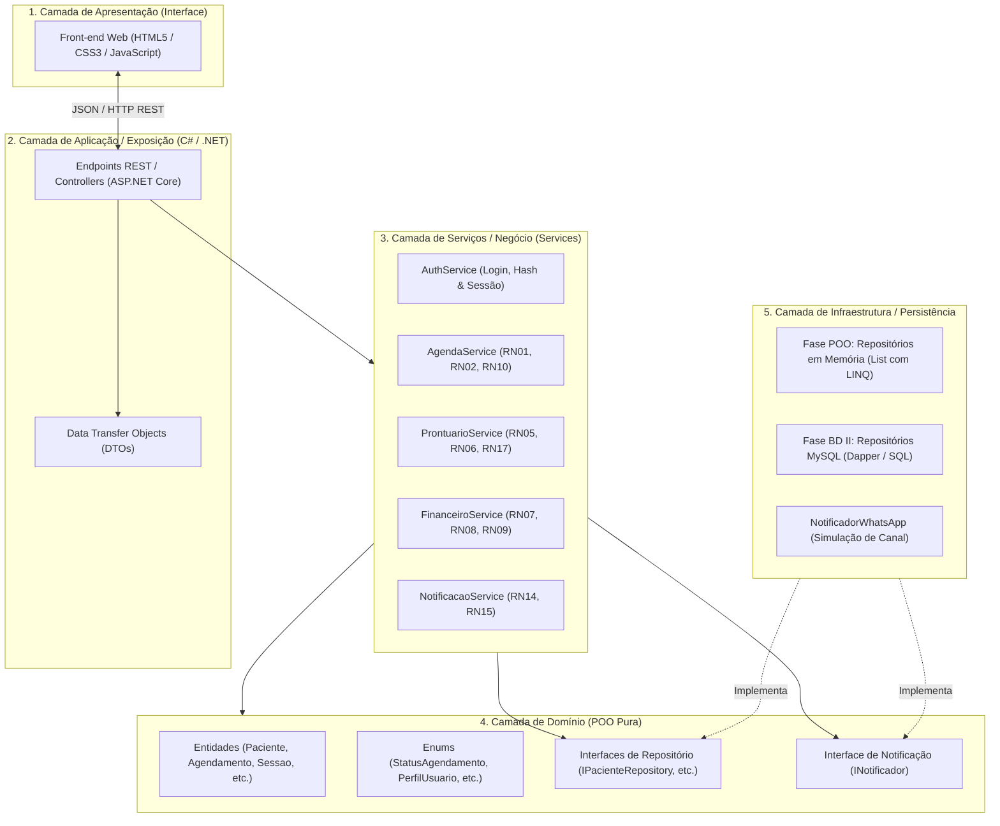

# Diagrama de Arquitetura do Sistema (Camadas)

> **Sistema de Agendamento e Prontuário para Clínicas Pequenas**  
> Estrutura arquitetural em camadas com isolamento de responsabilidades e desacoplamento de persistência.

---

## 1. Visão Geral da Arquitetura

O sistema adota uma arquitetura em camadas concêntricas (inspirada em princípios da *Clean Architecture* e *Onion Architecture*), onde o **Domínio (POO pura)** não conhece detalhes de infraestrutura ou de interface.

---

## 2. Princípios de Desacoplamento

1. **Agnóstico a Banco de Dados:**  
   Os serviços de aplicação (`Services`) dependem apenas dos contratos (`IRepository<T>`). No momento de POO, persistem em memória via `List<T>`; ao chegar na disciplina de BD II, substitui-se a injeção de dependência para a implementação concreta em **MySQL** sem tocar no Domínio.
2. **Agnóstico a Interface:**  
   O Domínio e as Regras de Negócio não possuem acoplamento com `Console.WriteLine` nem com frameworks de tela, expondo operações puras através de DTOs para o front-end Web.
