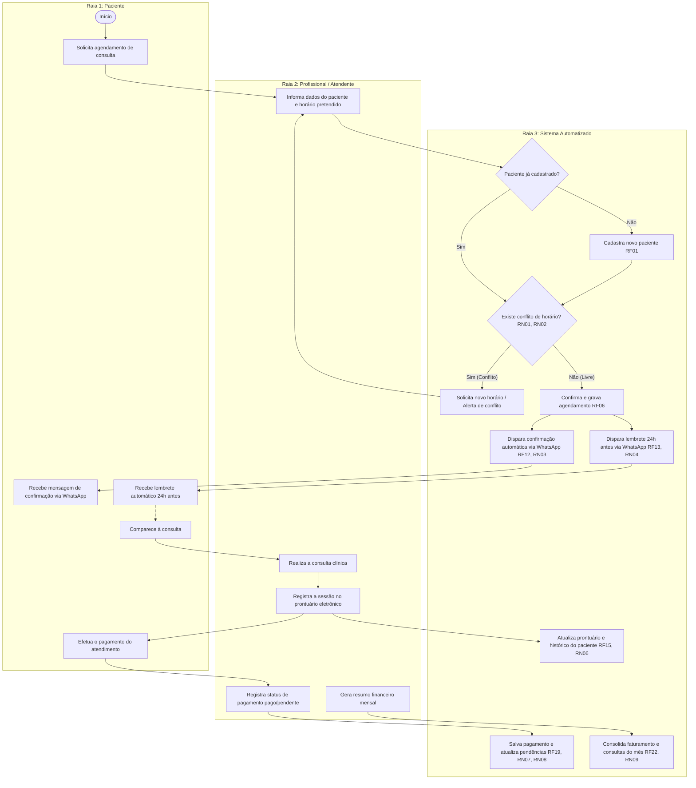

# Diagrama de Processo de Negócio "TO-BE" (BPMN / Raias)

> **Sistema de Agendamento e Prontuário para Clínicas Pequenas**  
> Mapeamento de processo de ponta a ponta estruturado em três raias: Paciente, Profissional e Sistema.

---

## 1. Visão do Fluxo de Processo com Raias (Swimlanes)

O fluxo TO-BE cobre desde o primeiro contato do paciente até a consolidação financeira mensal, integrando os requisitos funcionais e regras de negócio:

---

## 2. Destaques das Regras de Negócio Integradas ao Processo

* **RN01 / RN02:** Validação automática de conflito de agenda antes de qualquer confirmação.
* **RN03 / RN04:** Automação de confirmação imediata e lembrete preventivo 24h antes via WhatsApp.
* **RN05 / RN06:** Vinculação estrita entre a realização da consulta e a atualização do histórico clínico do paciente.
* **RN07 / RN08 / RN09:** Fechamento financeiro com suporte a pagamentos pendentes e consolidação mensal.
