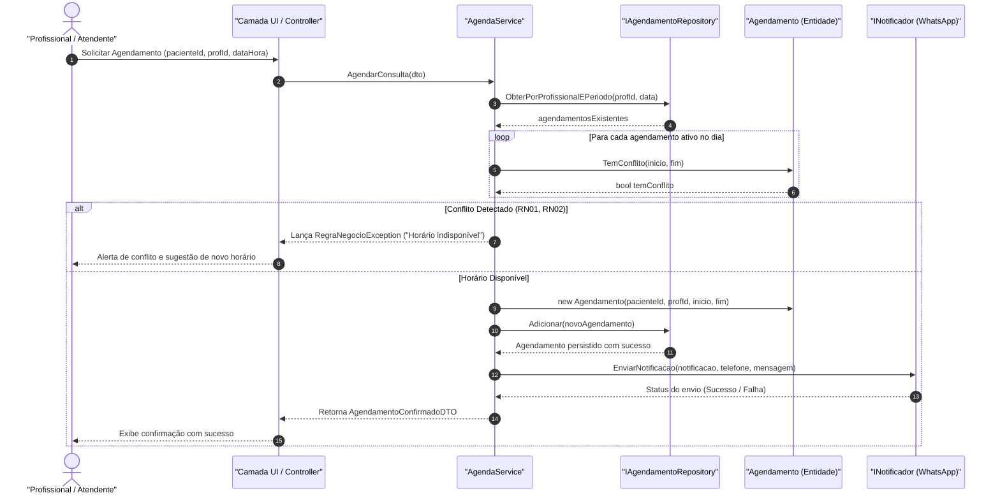

# Diagramas de Sequência UML (Fluxos Críticos)

> **Sistema de Agendamento e Prontuário para Clínicas Pequenas**  
> Documento visual complementar referente aos fluxos temporais de troca de mensagens entre objetos.

---

## 1. Fluxo Crítico 1: Agendamento de Consulta com Verificação de Conflito e Notificação

* **Requisitos e Regras Envolvidos:** RF06, RF09, RF12, RF13, RN01, RN02, RN03, RN04, RQ12.
* **Objetivo:** Garantir que nenhuma consulta seja agendada em sobreposição de horários e disparar a confirmação automática via WhatsApp.



---

## 2. Fluxo Crítico 2: Atendimento Clínico e Alteração de Prontuário com Histórico Imutável

* **Requisitos e Regras Envolvidos:** RF15, RF16, RF28, RN05, RN06, RN13, RN17, RQ07 (LGPD).
* **Objetivo:** Registrar o atendimento do paciente, permitir correções de anotações preservando versões anteriores e registrar log de auditoria.

```mermaid
sequenceDiagram
    autonumber
    actor Med as "Profissional de Saúde"
    participant UI as "Camada UI / Controller"
    participant Serv as "ProntuarioService"
    participant Repo as "IProntuarioRepository"
    participant Sessao as "SessaoProntuario (Entidade)"
    participant Versao as "VersaoAnotacao (Snapshot)"
    participant Log as "ILogRepository (Auditoria LGPD)"

    Med->>UI: Editar Anotação Clínica (sessaoId, novoTexto, motivo)
    UI->>Serv: AtualizarAnotacao(sessaoId, novoTexto, motivo, usuarioId)
    Serv->>Repo: ObterPorId(sessaoId)
    Repo-->>Serv: sessaoExistente

    Serv->>Sessao: AlterarAnotacao(novoTexto, motivo)
    create participant Versao
    Sessao->>Versao: new VersaoAnotacao(textoAnterior, DateTime.Now, motivo)
    Sessao->>Sessao: HistoricoVersoes.Add(versao)
    Sessao->>Sessao: AnotacoesClinicas = novoTexto

    Serv->>Repo: Atualizar(sessaoExistente)
    Repo-->>Serv: Prontuário persistido com versão arquivada

    Serv->>Log: RegistrarLog(usuarioId, "EDICAO_PRONTUARIO", sessaoId)
    Log-->>Serv: Log gravado com sucesso

    Serv-->>UI: Retorna SessaoAtualizadaDTO
    UI-->>Med: Confirmação de edição com integridade preservada
```
